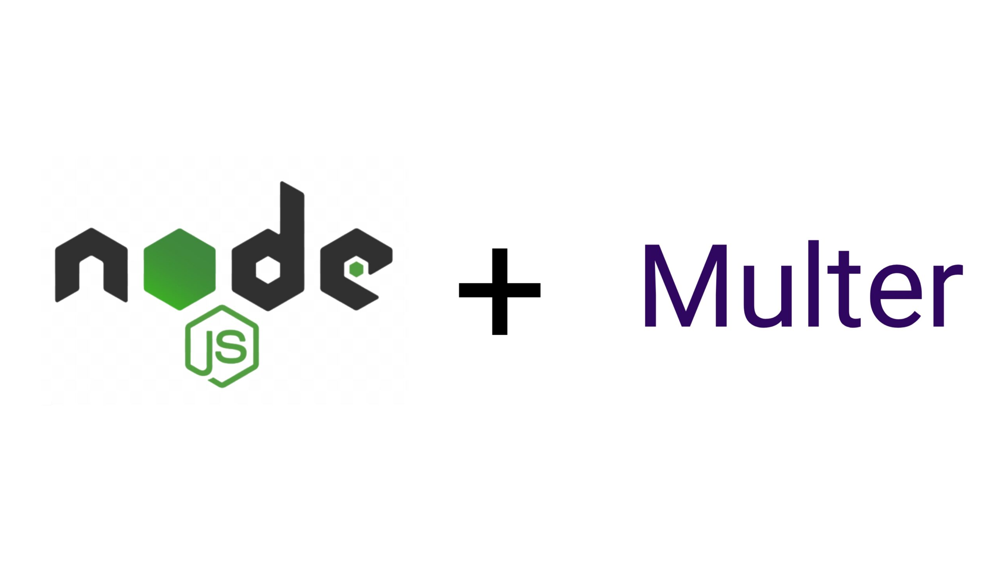

## Upload simples com Node JS e a biblioteca Multer

Sistema de upload simples de apenas uma única imagem por vez usando a biblioteca: [multer](https://www.npmjs.com/package/multer), além do ulpoad das imagens numa pasta específica do sistema (src/public/uploads), o sistema salva o nome da imagem no banco de dados postgres e renderiza na tela em formato de grid todas as imagens já salvas, a pasta uploads não é compartilhada no git para não subir as imagens salvas na pasta, basta criar a pasta no diretório citado nesse readme antes de fazer o upload de fato.

## Instalação

Para rodar o projeto deve ter instalado o Node JS e o NPM e rodar os comandos abaixo, além de será preciso ter a pasta onde as imagens serão salvas que fica no diretório 'src/public/uploads':

```bash
  npm install 
  npm run start
```

## Stack utilizada

**Back-end:** Node, Express, Multer \
**Front-end:** EJS, Bootstrap

## 🚀 Sobre mim
Eu sou uma pessoa desenvolvedora full-stack, usando as tecnologias Node JS no Back-end e React no Fron-end, API Restfull e estudando outras tecnologias interessantes e em alta no mercado.

## 🛠 Habilidades
Javascript, HTML, CSS, Node JS, PHP, Mongo DB, React, Sequelize ORM, Mongoose ORM...

## 🔗 Links
[](https://github.com/Diones25)
[](https://www.linkedin.com/in/diones-pereira-alves-31bb3969/)